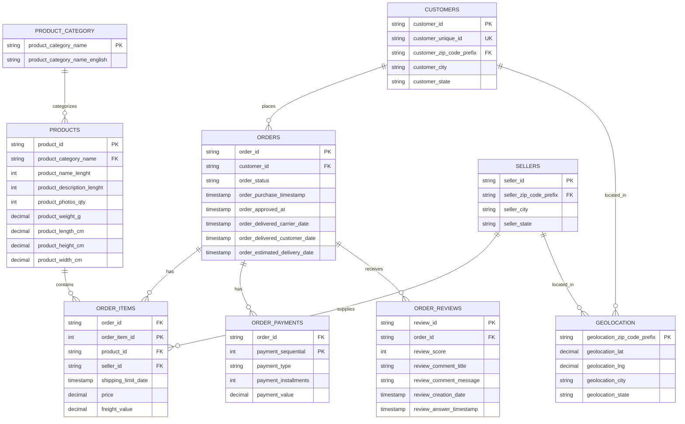

# Diagrama Entidad-Relación (ER)

## Descripción General
Este diagrama muestra la estructura de la base de datos que contiene información sobre un sistema de comercio electrónico con pedidos, clientes, productos, vendedores y reseñas.

## Diagrama ER

## Descripción de Entidades

### CUSTOMERS
- **Propósito**: Almacena información de los clientes
- **Clave Primaria**: `customer_id`
- **Clave Única**: `customer_unique_id`
- **Relaciones**: Un cliente puede realizar muchos pedidos

### ORDERS
- **Propósito**: Registra los pedidos realizados
- **Clave Primaria**: `order_id`
- **Clave Foránea**: `customer_id` (referencia a CUSTOMERS)
- **Relaciones**: Un pedido contiene múltiples items, pagos y puede tener reseñas

### ORDER_ITEMS
- **Propósito**: Detalle de los productos en cada pedido
- **Clave Primaria**: Compuesta por `order_id` + `order_item_id`
- **Claves Foráneas**: `product_id` (PRODUCTS), `seller_id` (SELLERS)
- **Relaciones**: Vincula productos y vendedores con pedidos

### ORDER_PAYMENTS
- **Propósito**: Información de pagos de los pedidos
- **Clave Primaria**: Compuesta por `order_id` + `payment_sequential`
- **Clave Foránea**: `order_id` (referencia a ORDERS)
- **Nota**: Un pedido puede tener múltiples pagos (cuotas)

### ORDER_REVIEWS
- **Propósito**: Reseñas y comentarios de los clientes sobre pedidos
- **Clave Primaria**: `review_id`
- **Clave Foránea**: `order_id` (referencia a ORDERS)
- **Información**: Incluye puntuación, comentarios y fechas

### PRODUCTS
- **Propósito**: Catálogo de productos disponibles
- **Clave Primaria**: `product_id`
- **Clave Foránea**: `product_category_name` (referencia a PRODUCT_CATEGORY)
- **Información**: Características físicas y descriptivas del producto

### PRODUCT_CATEGORY
- **Propósito**: Clasificación de categorías de productos
- **Clave Primaria**: `product_category_name`
- **Información**: Traducción de categoría al inglés

### SELLERS
- **Propósito**: Información de vendedores
- **Clave Primaria**: `seller_id`
- **Clave Foránea**: `seller_zip_code_prefix` (referencia a GEOLOCATION)
- **Relaciones**: Un vendedor puede suministrar múltiples productos en diferentes pedidos

### GEOLOCATION
- **Propósito**: Información de ubicación geográfica por código postal
- **Clave Primaria**: `geolocation_zip_code_prefix`
- **Información**: Coordenadas (latitud/longitud), ciudad y estado
- **Relaciones**: Utilizada para ubicar clientes y vendedores

## Relaciones Principales

| De | Para | Tipo | Descripción |
|---|---|---|---|
| CUSTOMERS | ORDERS | 1:N | Un cliente realiza muchos pedidos |
| CUSTOMERS | GEOLOCATION | N:1 | Muchos clientes en una ubicación |
| ORDERS | ORDER_ITEMS | 1:N | Un pedido contiene muchos items |
| ORDERS | ORDER_PAYMENTS | 1:N | Un pedido puede tener múltiples pagos |
| ORDERS | ORDER_REVIEWS | 1:N | Un pedido puede recibir reseñas |
| PRODUCTS | ORDER_ITEMS | 1:N | Un producto puede estar en múltiples pedidos |
| SELLERS | ORDER_ITEMS | 1:N | Un vendedor surte múltiples items |
| SELLERS | GEOLOCATION | N:1 | Muchos vendedores en una ubicación |
| PRODUCTS | PRODUCT_CATEGORY | N:1 | Muchos productos en una categoría |
